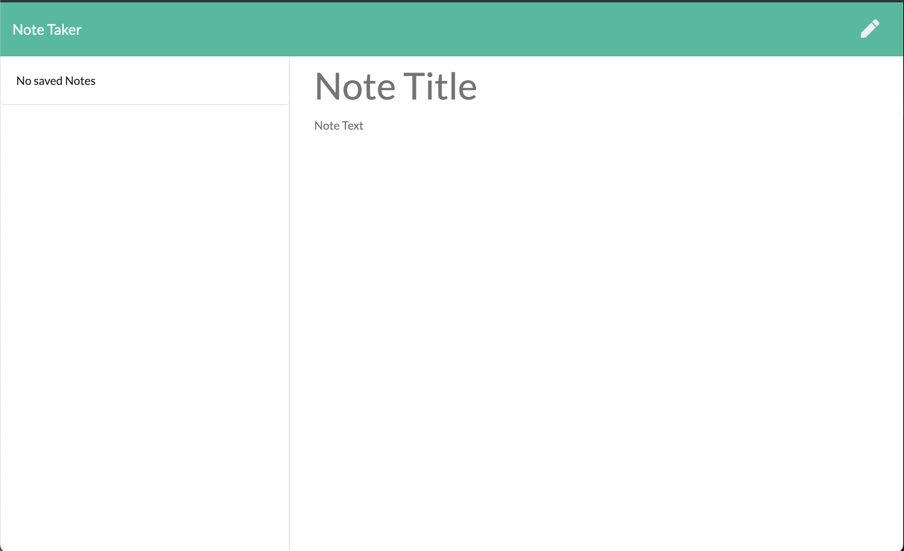
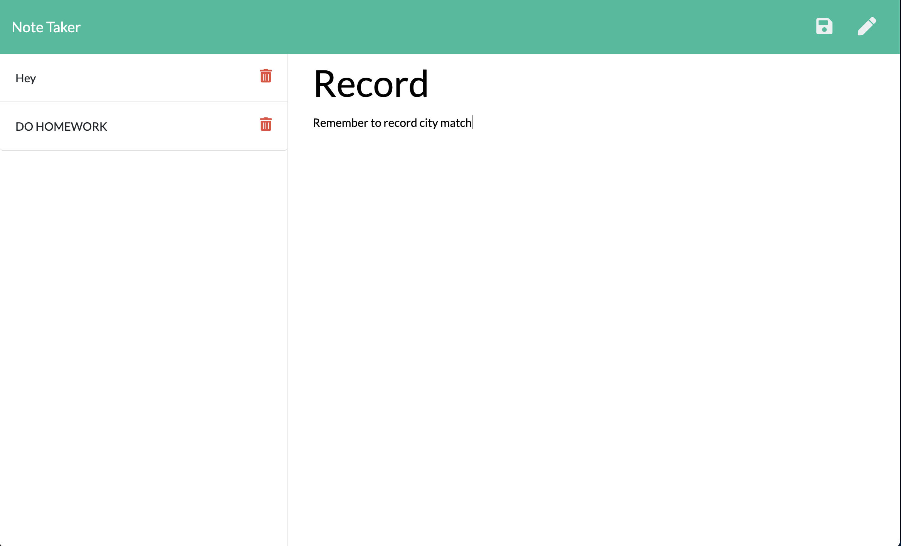

# Note-Taker

## Description

This application can be used to write, save, and delete notes. This application uses an express.js backend
to save and retrieve note data from a JSON file.

## User Story

AS A user, I want to be able to write and save notes

I WANT to be able to delete notes I've written before

SO THAT I can organize my thoughts and keep track of tasks I need to complete

# Technology

* UUID 
* Javascript
* HTML
* Express.js
* Heroku
* PATH
* CSS
* BOOTSTRAP

## Business Context

For users that need to keep track of a lot of information, it's easy to forget or be unable to recall something important. Being able to take persistent notes allows users to have written information available when needed.

## Repository

*  https://warm-woodland-02943.herokuapp.com/
* https://github.com/Vinyl77/note-taker
* https://github.com/Vinyl77